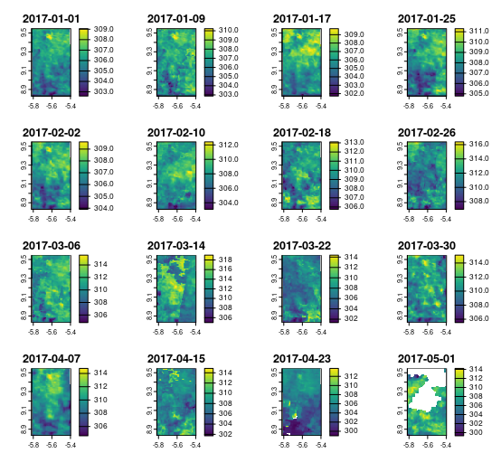

<!-- README.md is generated from README.Rmd. Please edit that file -->
```{r include=FALSE}
knitr::opts_chunk$set(
  fig.path = "man/figures/README-",
  out.width = "100%"
)
library(magrittr)
library(modisfast)
library(dplyr)
```
# modisfast 
<!--  -->

<!-- badges: start -->
[](https://www.r-project.org/Licenses/GPL-3)
[](https://cran.r-project.org/package=modisfast)
[](https://github.com/ptaconet/modisfast)
[](https://archive.softwareheritage.org/browse/origin/?origin_url=https://github.com/ptaconet/modisfast)
[](https://github.com/ptaconet/modisfast/actions/workflows/R-CMD-check.yaml)
<!-- badges: end -->

<!-- ATTENTION A CHANGER : FUSEAUX HORAIRES POUR DONNEES GPM HALF HOURLY !!!!!!
AUSSI : min filesize (le fichier peut etre plus petit que 50 k.. e.g. titi)
renvoyer erreur ou warning si le fichier n'existe pas
-->

 <!-- `r emo::ji("warning")` Package still under development ! -->

<!--
R package to access various spatiotemporal Earth science data collections in R using the [OPeNDAP framework](https://www.opendap.org/about/). Currently implemented data collections are [MODIS](https://lpdaac.usgs.gov/data/get-started-data/collection-overview/missions/modis-overview/), [VIIRS](https://lpdaac.usgs.gov/data/get-started-data/collection-overview/missions/s-npp-nasa-viirs-overview/), [GPM](https://pmm.nasa.gov/GPM) and [SMAP](https://smap.jpl.nasa.gov/)). 
Opendap (*Open-source Project for a Network Data Access Protocol*) is a data access protocol that enables to subset the data  - spatially, temporally, etc. - directly at the downloading phase. Filters are provided directly within a http url. For example the following URL : 
https://opendap.cr.usgs.gov/opendap/hyrax/MOD11A1.006/h17v08.ncml.nc4?MODIS_Grid_Daily_1km_LST_eos_cf_projection,LST_Day_1km[6093:6122][55:140][512:560],LST_Night_1km[6093:6122][55:140][512:560],QC_Day[6093:6122][55:140][512:560],QC_Night[6093:6122][55:140][512:560],time[6093:6122],YDim[55:140],XDim[512:560]
provides the MOD11A1.006 (MODIS/Terra Land Surface Temperature/Emissivity Daily L3 Global 1km SIN Grid V006) data in netCDF, subsetted for bands LST_Day_1km, LST_Night_1km, QC_Day, QC_Night, for each day between the 2017-01-01 and the 2017-01-30, and within the following bounding box (lon/lat): -5.41 8.84, -5.82 9.54.
This package enables to build OPeNDAP (https) URLs given input parameters such as a data collection, region and time range of interst . These URLs can then be used to either download the data to your workspace or computer, or access the datacube directly as an R object (of class `ndcf4`, `raster`, `stars`, etc.)
-->
**`modisfast`** (formerly `opendapr`) is an R package that provides functions to **speed-up** the **download** of time-series raster data products derived from some [**MODIS**](https://lpdaac.usgs.gov/data/get-started-data/collection-overview/missions/modis-overview/) and [**VIIRS**](https://lpdaac.usgs.gov/data/get-started-data/collection-overview/missions/s-npp-nasa-viirs-overview/) observations, as well as other widely-used satellite-derived environmental data (e.g. Global Precipitation Measurement Mission).

**`modisfast`** uses the abilities offered by the [OPeNDAP framework](https://www.opendap.org/about/) (*Open-source Project for a Network Data Access Protocol*) to download a subset of Earth science data cube, along spatial, temporal or any other data dimension (depth, ...). This way, it reduces downloading time and disk usage to their minimum : no more 1° x 1° MODIS tiles with 10 bands when your region of interest is only 30 km x 30 km wide and you need 2 bands ! Moreover, `modisfast` enables parallel downloads of data.

`modisfast` is hence particularly suited for retrieving MODIS or VIIRS data **over long time series** and **over areas**, rather than short time series and points.

Below is a comparison of modisfast with other packages available for downloading chunks of remote sensing data :


|    Package                                           | Data  |  Temporal subsetting* | Spatial subsetting* | Dimensional subsetting*   | Speed |
| :-------------------------------------------------- | :-------------: | :-------------: |  :-------------: | :-------------: | :-------------: | 
| [`modisfast`](https://github.com/ptaconet/modisfast)      | MODIS, VIIRS, GPM |  :white_check_mark: |  :white_check_mark:  |   :white_check_mark:  |   :white_check_mark:  
| [`MODIS`](https://github.com/fdetsch/MODIS)       | MODIS  |  :white_check_mark: |  :x:  |  :x:  |   :white_check_mark:  
| [`MODIStsp`](https://github.com/ropensci/MODIStsp)   |  MODIS |  :white_check_mark: |   :x:   |  :white_check_mark: |   :white_check_mark:  
| [`MODISTools`](https://github.com/ropensci/MODISTools)  |  MODIS and VIIRS (but not all collections)  |  :white_check_mark: |   :white_check_mark:   |   :white_check_mark: |   :white_check_mark:  
| [`appeears`](https://github.com/bluegreen-labs/appeears)  |  MODIS, VIIRS, and many others  |  :white_check_mark: |   :white_check_mark:   |   :white_check_mark: |  :x:

\* at the downloading phase

## Installation

You can install the released version of `modisfast` from [CRAN](https://CRAN.R-project.org) with :

``` r
install.packages("modisfast")
```

or the development version (to get a bug fix or to use a feature from the development version) with : 

``` r
if(!require(devtools)){install.packages("devtools")}
devtools::install_github("ptaconet/modisfast")
```

## Get Started 

Accessing and opening MODIS data with `modisfast` is a simple 3-steps workflow, as shown in the example below.

**1/ First, define the variables of interest (ROI, time frame, collection, and bands) :**

```{r , eval = F, message=F}

# Load the packages
library(modisfast)
library(sf)
library(terra)

# ROI and time range of interest
roi <- st_as_sf(data.frame(id = "roi_id", geom = "POLYGON ((-5.82 9.54, -5.42 9.55, -5.41 8.84, -5.81 8.84, -5.82 9.54))"), wkt="geom", crs = 4326) # a ROI of interest, format sf polygon
time_range <- as.Date(c("2017-01-01","2017-06-01"))  # a time range of interest

# MODIS collections and variables (bands) of interest
collection <- "MOD11A2.061"  # run mf_list_collections() for an exhaustive list of collections available
variables <- c("LST_Day_1km","LST_Night_1km","QC_Day","QC_Night") # run mf_list_variables("MOD11A2.061") for an exhaustive list of variables available for the collection "MOD11A1.062"

```

**2/ Then, get the URL of the data and download them :**

```{r , eval = F, message=F}

## Login to Earthdata servers with your EOSDIS credentials. 
# To create an account (free) go to : https://urs.earthdata.nasa.gov/.
log <- mf_login(credentials = c("username","password"))  # set your own EOSDIS username and password

## Get the URLs of the data 
urls <- mf_get_url(
  collection = collection,
  variables = variables,
  roi = roi,
  time_range = time_range
 )

## Download the data. By default the data is downloaded in a temporary directory, but you can specify a folder
res_dl <- mf_download_data(urls, parallel = T)

```

**3/ And finally, open the data in R as a `terra::SpatRaster` object using the function `mf_import_data()`** ( :warning: see [here](https://ptaconet.github.io/modisfast/articles/get_started.html#warning-import) why you should use this function, instead of the original `terra::rast()`, in the context of `modisfast`) :

```{r , eval = F, message=F}

r <- mf_import_data(
  path = dirname(res_dl$destfile[1]),
  collection = collection, 
  proj_epsg = 4326
  )

terra::plot(r)

```




et voilà ! 

Want more examples of use of `modisfast` ? **Have a look at the [`vignette("get_started")`](https://ptaconet.github.io/modisfast/articles/get_started.html) to get started with a simple example, and see the [`vignette("modisfast2")`](https://ptaconet.github.io/modisfast/articles/modisfast2.html) for a more advanced workflow !**

<!--
## Objectives
modisfast provides an entry point to some specific OPeNDAP servers (e.g. MODIS, VNP, GPM or SMAP) via HTTPS. The development of the package was motivated by the following reasons : 
* **Providing a simple and single way in R to download data stored on heterogeneous servers** : People that use Earth science data often struggle with data access. In modisfast we propose a harmonized way to download data from various providers that have implemented access to their data through OPeNDAP.
* **Fastening the data import phase**, especially for large time series analysis.
Apart from these performance aspects, ethical considerations have driven the development of this package :
* **Facilitating the access to Earth science data for R users in places where internet connection is slow or expensive** : Earth science products are generally huge files that can be quite difficult to download in places with slow internet connection, even more if large time series are needed. By enabling to download strictly the data that is needed, the products become more accessible in those places;
* **Caring about the environmental digital impact of our research work** : Downloading data has an impact on environment and to some extent contributes to climate change. By downloading only the data that is need (rather than e.g a whole MODIS tile, or a global SMAP or GPM dataset) we somehow promote digital sobriety. 
* **Supporting the open-source-software movement** : The OPeNDAP is developed and advanced openly and collaboratively, by the non-profit [OPeNDAP, Inc.](https://www.opendap.org/about/) This open, powerfull and standard data access protocol is more and more used, by major Earth science data providers (e.g. NASA or NOAA). Using OPeNDAP means supporting methods for data access protocols that are open, build collaboratively and shared.
-->

<!--
## Citation
We thank in advance people that use `modisfast` for citing it in their work / publication(s). For this, please use the citation provided at this link [zenodo link to add] or through `citation("modisfast")`.
-->

## Collections available in modisfast {#coll-available}

Currently `modisfast` supports download of `r nrow(mf_list_collections())` data collections, extracted from the following meta-collections : 

* [MODIS land products](https://lpdaac.usgs.gov/data/get-started-data/collection-overview/missions/modis-overview/) made available by the [NASA / USGS LP DAAC](https://lpdaac.usgs.gov/) ( :arrow_right: [source OPeNDAP server](https://opendap.cr.usgs.gov/opendap/hyrax/)) ;
* [VIIRS land products](https://lpdaac.usgs.gov/data/get-started-data/collection-overview/missions/s-npp-nasa-viirs-overview/) made available by the [NASA / USGS LP DAAC](https://lpdaac.usgs.gov/) ( :arrow_right: [source OPeNDAP server](https://opendap.cr.usgs.gov/opendap/hyrax/))

In addition, `modisfast` supports download of the following satellite-derived environmental data :

* [Global Precipitation Measurement](https://gpm.nasa.gov/missions/GPM) (GPM) made available by the [NASA / JAXA GES DISC](https://disc.gsfc.nasa.gov/) ( :arrow_right: [source OPeNDAP server](https://gpm1.gesdisc.eosdis.nasa.gov/opendap/hyrax/GPM_L3/)).

Details of each product available for download are provided in the tables below or through the function `mf_list_collections()`. Want more details on a specific collection ? Click on the "DOI" column !

<details><summary><b>MODIS and VIIRS data collections accessible with modisfast (click to expand)</b></summary>
<p>

```{r, eval = TRUE, echo=F,message=F}
library(kableExtra)
mf_list_collections() %>%
  dplyr::filter(source %in% c("MODIS","VIIRS")) %>%
  dplyr::select(collection,long_name,source,nature,doi,url_programmatic_access) %>%
  dplyr::rename(Collection=collection,Nature=nature,Name=long_name,DOI=doi,Opendap_server=url_programmatic_access,Source=source) %>%
  kable() %>%
  kable_styling()
```

</p>
</details>

<details><summary><b>Other (non-MODIS or VIIRS) data collections accessible with modisfast (click to expand)</b></summary>
<p>

```{r, eval = TRUE, echo=F,message=F}
library(kableExtra)
mf_list_collections() %>%
    dplyr::filter(!(source %in% c("MODIS","VIIRS"))) %>%
  dplyr::select(collection,long_name,source,nature,doi,url_programmatic_access) %>%
  rename(Collection=collection,Nature=nature,Name=long_name,DOI=doi,Opendap_server=url_programmatic_access,Source=source) %>%
  kable() %>%
  kable_styling()
```

</p>
</details>

## Similar packages

`modisfast` is particularly suited for retrieving MODIS or VIIRS data **over long time series** and **over areas**, rather than short time series and points.

There are other R packages available for accessing MODIS data, which may be more suitable if your requirements differ. These include : 

* [`MODIS`](https://github.com/fdetsch/MODIS)
* [`MODIStsp`](https://github.com/ropensci/MODIStsp)
* [`MODIStools`](https://github.com/ropensci/MODIStools)
* [`appeears`](https://github.com/bluegreen-labs/appeears)

## Next steps

Next developments may involve including access to more collections from other OPeNDAP servers, and submitting the package to the [rOpenSci](https://ropensci.org/) archives.

Any contribution is welcome !

## License and citation

This package is licensed under a [GNU General Public License v3.0 or later](https://www.gnu.org/licenses/gpl-3.0-standalone.html) license. 

We thank in advance people that use `modisfast` for citing it in their work / publication(s). For this, please use the following citation : 

*Taconet, P. & Moiroux N.(2024). modisfast: Fast and Efficient Access to MODIS Earth Observation Data. In CRAN: Contributed Packages. The R Foundation. https://doi.org/10.32614/cran.package.modisfast *

## Under the woods... how does `modisfast` work ? 

`modisfast` is an R wrapper for OPeNDAP (*Open-source Project for a Network Data Access Protocol*). When utilized by data providers, such as those managing many NASA datasets, OPeNDAP allows for subsetting portions of Earth observation cubes based on any dimension by specifying filters in a URL. `modisfast` facilitates this process by constructing the URL based on the spatial, temporal, and dimensional filters provided by the user in the function `mf_get_url()`.

Let's take an example to understand.

The following URL :arrow_down:

https<nolink>://opendap.cr.usgs.gov/opendap/hyrax/MOD11A2.061/h17v08.ncml.nc4?MODIS_Grid_8Day_1km_LST_eos_cf_projection,LST_Day_1km[775:793][55:140][512:560],LST_Night_1km[775:793][55:140][512:560],QC_Day[775:793][55:140][512:560],QC_Night[775:793][55:140][512:560],time[775:793],YDim[55:140],XDim[512:560]

provides a link to download the [MOD11A2.061](https://doi.org/10.5067/MODIS/MOD11A2.061) data in netCDF, subsetted for :

- bands LST_Day_1km, LST_Night_1km, QC_Day, QC_Night ;
- each available date between the 2017-01-01 and the 2017-06-01 ; 
- within the following bounding box (lon/lat): -5.41 8.84, -5.82 9.54. 

The indices within the `[]` refer to values encoding for the spatial and temporal filters.

These OPeNDAP URLs are not trivial to build. `modisfast` converts the spatial, temporal and dimensional filters (R objects) provided by the user through the function `mf_get_url()` into the appropriate OPeNDAP URL(s). Subsequently, the function `mf_download_data()` allows for downloading the data using the [`httr`](https://cran.r-project.org/package=httr) and `parallel` packages. 

## Acknowledgments

We thank NASA and its partners for making all their Earth science data freely available, and implementing open data access protocols such as OPeNDAP. `modisfast` heavily builds on top of the OPeNDAP, so we thank the non-profit [OPeNDAP, Inc.](https://www.opendap.org/about/) for developing the eponym tool in an open and collaborative way.

We also thank the contributors that have tested the package, reviewed the documentation and brought valuable feedbacks to improve the package : [Florian de Boissieu](https://github.com/floriandeboissieu), Julien Taconet, [Nicolas Moiroux](https://github.com/Nmoiroux)

The initial development and first release of this package were financed by the MIVEGEC unit of the [French Research Institute for Sustainable Development](https://en.ird.fr/), as part of the REACT project.

By enabling to download subsets of data cubes, `modisfast` facilites the access to Earth science data for R users in places where internet connection is slow or expensive and promotes digital sobriety for our research work. 

The OPeNDAP, over which the package builds, is a project developed by the non-profit [OPeNDAP, Inc.](https://www.opendap.org/about/) and advanced openly and collaboratively. By using this data access protocol, `modisfast` support the open-source-software movement.
