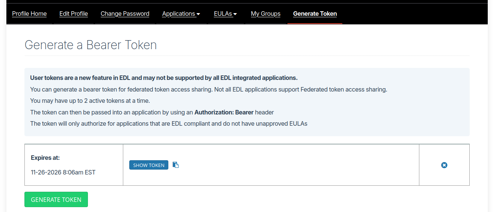

<!-- README.md is generated from README.Rmd. Please edit that file -->
```{r include=FALSE}
library(magrittr)
library(modisfast)
library(dplyr)
library(kableExtra)
library(knitr)

knitr::opts_chunk$set(
  fig.path = "man/figures/README-",
  out.width = "100%"
)
```
# modisfast <a href="https://github.com/ptaconet/modisfast"></a>
<!--  -->

<!-- badges: start -->
[](https://www.r-project.org/Licenses/GPL-3)
[](https://cran.r-project.org/package=modisfast)
[](https://github.com/ptaconet/modisfast)
[](https://github.com/ptaconet/modisfast/actions/workflows/R-CMD-check.yaml)
[](https://doi.org/10.21105/joss.07343)

<!-- [](https://archive.softwareheritage.org/browse/origin/?origin_url=https://github.com/ptaconet/modisfast) -->
<!-- [](https://doi.org/10.5281/zenodo.12772739) -->
<!-- badges: end -->


## Table of contents

<p align="left">
  • <a href="#overview">Overview</a><br>
  • <a href="#installation">Installation</a><br>
  • <a href="#get-started">Get started</a><br>
  • <a href="#collections-available-in-modisfast">Data collections available</a><br>
  • <a href="#manual-testing-of-the-functionality">Manual testing of the functionality</a><br>
  • <a href="#foundational-framework">Foundational framework</a><br>
  • <a href="#comparison-with-similar-r-packages">Comparison with similar R packages</a><br>
  • <a href="#citation">Citation</a><br>
  • <a href="#future-developments">Future developments</a><br>
  • <a href="#contributing">Contributing</a><br>
  • <a href="#acknowledgments">Acknowledgments</a><br>
</p>

## News

2026-09-29 :

**`modisfast` is back!**

- After a year-long interruption caused by the migration of NASA’s data servers, `modisfast` is back
- `modisfast` now uses the new [NASA Earthdata Cloud OPeNDAP endpoint](https://opendap.earthdata.nasa.gov) for MODIS and VIIRS collections !
- Authentication to access data is now dealt with an Earthdata token instead of username and password.

## Overview

**`modisfast`** is an R package designed for **easy** and **fast** downloads of [**MODIS**](https://www.earthdata.nasa.gov/data/instruments/modis) Land products, [**VIIRS**](https://www.earthdata.nasa.gov/data/instruments/viirs) Land products, and [**GPM**](https://earth.gsfc.nasa.gov/hydro/missions/global-precipitation-measurement-gpm) (Global Precipitation Measurement Mission) Earth Observation data.

`modisfast` uses the abilities offered by the [OPeNDAP](https://www.opendap.org/about/) framework (*Open-source Project for a Network Data Access Protocol*) to download a subset of Earth Observation data cube, along spatial, temporal or any other data dimension (depth, ...). This way, it reduces downloading time and disk usage to their minimum : no more 1° x 1° MODIS tiles with 10 bands when your region of interest is only 30 km x 30 km wide and you need 2 bands ! Moreover, `modisfast` enables parallel downloads of data.

This package is hence particularly suited for retrieving MODIS or VIIRS data **over long time series** and **over areas**, rather than short time series and points.

Importantly, the robust, sustainable, and cost-free [foundational framework](#foundational-framework) of `modisfast`, both for the data provider (NASA) and the software (R, OPeNDAP, the `tidyverse` and `GDAL` suite of packages and software), guarantees the long-term reliability and open-source nature of the package.

By enabling to download subsets of data cubes, `modisfast` facilites the access to Earth science data for R users in places where internet connection is slow or expensive and promotes digital sobriety for our research work. 

## Installation

You can install the released version of `modisfast` from [CRAN](https://CRAN.R-project.org) with :

``` r
install.packages("modisfast")
```

or the development version (to get a bug fix or to use a feature from the development version) with : 

``` r
if(!require(devtools)){install.packages("devtools")}
devtools::install_github("ptaconet/modisfast")
```

## Get Started 

This example shows how to download and import a 1-year long time series of MODIS Land Surface Temperature (LST) at 6 km spatial resolution / 1 month temporal resolution over the whole country of Madagascar (collection [MOD11B3.061](https://doi.org/10.5067/MODIS/MOD11B3.061)).

**Fist, you need to retrieve your Earthdata token**. This token is mandatory to access the data. You can get it here : https://urs.earthdata.nasa.gov/ . 


**Next, run the following code**

```{r , eval = F, message=F}
# set your EarthData token as an environment system :
Sys.setenv(EARTHDATA_TOKEN = "your Earthdata bearer token")

# Load the packages
library(modisfast)
library(sf)
library(terra)

# Set ROI and time range of interest
roi <- st_as_sf(data.frame(id = "madagascar", geom = "POLYGON((41.95 -11.37,51.26 -11.37,51.26 -26.17,41.95 -26.17,41.95 -11.37))"), wkt = "geom", crs = 4326) # a ROI of interest, format sf polygon
time_range <- as.Date(c("2025-01-01", "2025-12-31")) # a time range of interest (or single date)

# Set MODIS collections and variables (bands) of interest
collection <- "MOD11B3.061" # run mf_list_collections() for an exhaustive list of collections available
variables <- c("LST_Day_6km") # run mf_list_variables("MOD11B3.061") for an exhaustive list of variables available for the collection MOD11B3.061

## Get the URLs of the data with mf_get_url() 
urls <- mf_get_url(
  collection = collection,
  variables = variables,
  roi = roi,
  time_range = time_range
)

## Download the data with mf_download_data(). By default the data is downloaded in a temporary directory, but you can specify a folder
res_dl <- mf_download_data(urls, 
                           parallel = TRUE, 
                           num_workers = 3)


# And finally, import the data in R as a terra::SpatRaster object using the function mf_import_data()
r <- mf_import_data(
  path = dirname(res_dl$destfile[1]),
  collection = collection,
  proj_epsg = 4326,
  roi_mask = roi
)

terra::plot(r, col = rev(terrain.colors(20)))
```


\
et voilà ! 

Want more examples ? `modisfast` provides a [long-form documentations and examples to learn more about the package](https://ptaconet.github.io/modisfast/articles/get_started.html)(https://ptaconet.github.io/modisfast/articles/get_started.html)


<!--
## Objectives
modisfast provides an entry point to some specific OPeNDAP servers (e.g. MODIS, VNP, GPM or SMAP) via HTTPS. The development of the package was motivated by the following reasons : 
* **Providing a simple and single way in R to download data stored on heterogeneous servers** : People that use Earth science data often struggle with data access. In modisfast we propose a harmonized way to download data from various providers that have implemented access to their data through OPeNDAP.
* **Fastening the data import phase**, especially for large time series analysis.
Apart from these performance aspects, ethical considerations have driven the development of this package :
* **Facilitating the access to Earth science data for R users in places where internet connection is slow or expensive** : Earth science products are generally huge files that can be quite difficult to download in places with slow internet connection, even more if large time series are needed. By enabling to download strictly the data that is needed, the products become more accessible in those places;
* **Caring about the environmental digital impact of our research work** : Downloading data has an impact on environment and to some extent contributes to climate change. By downloading only the data that is need (rather than e.g a whole MODIS tile, or a global SMAP or GPM dataset) we somehow promote digital sobriety. 
* **Supporting the open-source-software movement** : The OPeNDAP is developed and advanced openly and collaboratively, by the non-profit [OPeNDAP, Inc.](https://www.opendap.org/about/) This open, powerfull and standard data access protocol is more and more used, by major Earth science data providers (e.g. NASA or NOAA). Using OPeNDAP means supporting methods for data access protocols that are open, build collaboratively and shared.
-->

<!--
## Citation
We thank in advance people that use `modisfast` for citing it in their work / publication(s). For this, please use the citation provided at this link [zenodo link to add] or through `citation("modisfast")`.
-->

## Collections available in `modisfast`

Currently `modisfast` supports download of `r nrow(mf_list_collections())` data collections, extracted from the following meta-collections : 

* [MODIS land products](https://www.earthdata.nasa.gov/data/instruments/modis) made available by the [NASA / USGS LP DAAC](https://www.earthdata.nasa.gov/centers/lp-daac) ;
* [VIIRS land products](https://www.earthdata.nasa.gov/data/instruments/viirs) made available by the [NASA / USGS LP DAAC](https://www.earthdata.nasa.gov/centers/lp-daac)
* [Global Precipitation Measurement](https://earth.gsfc.nasa.gov/hydro/missions/global-precipitation-measurement-gpm) (GPM) made available by the [NASA / JAXA GES DISC](https://www.earthdata.nasa.gov/centers/gesdisc-daac).

Details of each product available for download are provided in the tables below or through the function `mf_list_collections()`.


```{r, eval = TRUE, echo=F,message=F}

fun_display_coll <- function(filts){
  
  cols <- mf_list_collections() %>%
  dplyr::filter(nature %in% filts) %>%
  dplyr::mutate(collection = cell_spec(collection, "html", link = doi)) %>%
  dplyr::mutate(spatial_resolution_m = paste0(spatial_resolution_m, " m")) %>%
  dplyr::mutate(temporal_resolution = paste0(temporal_resolution," ",temporal_resolution_unit)) %>%
  dplyr::mutate(temporal_resolution = ifelse(temporal_resolution=="1 day", "Daily", temporal_resolution)) %>%
  dplyr::mutate(start_date = paste0(start_date," to present")) %>%
  dplyr::select(collection, source, nature, long_name, spatial_resolution_m, temporal_resolution, start_date) %>%
  dplyr::arrange(nature, source, spatial_resolution_m, rev(temporal_resolution)) %>% 
  dplyr::rename(Collection = collection, Type = nature, Name = long_name, Source = source, 'Spatial resolution' = spatial_resolution_m, 'Temporal resolution' = temporal_resolution, 'Temporal extent' = start_date) %>%
  kable("html", escape = FALSE) %>%
  kable_styling(bootstrap_options = c("hover", "condensed"))
  
  return(cols)
  
}

cols_natures <- sort(unique(mf_list_collections()$nature))

```


```{r, eval = TRUE, echo=F, message=F, results='asis'}
for(i in seq_along(cols_natures)){
  if(i==1){
     cat('<details><summary><b>',cols_natures[i],'</b> data collections <b>(click to expand)</b></summary>')
  } else {
      cat('<details><summary><b>',cols_natures[i],'</b> data collections</summary>')
  }
  cat(knitr::asis_output(fun_display_coll(cols_natures[i])))
  cat('</details>')
}
```


## Manual testing of the functionality

Since most `modisfast` functions depend on EarthData credentials/token, automated tests are disabled. However, after installation, users can manually test the package’s functionality by running these lines of code :

```r
Sys.setenv(EARTHDATA_TOKEN = "your Earthdata bearer token")
devtools::test("~path/to/modisfast")
```

## Foundational framework  {#foundational-framework}

Technically, `modisfast` is a programmatic interface (R wrapper) to several NASA [OPeNDAP](https://www.opendap.org/) servers. OPeNDAP is the acronym for *Open-source Project for a Network Data Access Protocol* and designates both the software, the access protocol, and the corporation that develops them. The OPeNDAP is designed to simplify access to structured and high-volume data, such as satellite products, over the Web. It is a collaborative effort involving multiple institutions and companies, with open-source code, free software, and adherence to the [Open Geospatial Consortium](https://www.ogc.org/) (OGC) standards. It is widely used by NASA, which partly finances it. 

A key feature of OPeNDAP is its capability to apply filters at the data download process, ensuring that only the necessary data is retrieved. These filters, specified within a URL, can be spatial, temporal, or dimensional. Although powerful, OPeNDAP URLs are not trivial to build. `modisfast` facilitates this process by constructing the URL based on the spatial, temporal, and dimensional filters provided by the user in the function `mf_get_url()`.

These OPeNDAP URLs are not trivial to build. `modisfast` converts the spatial, temporal and dimensional filters (R objects) provided by the user through the function `mf_get_url()` into the appropriate OPeNDAP URL(s). Subsequently, the function `mf_download_data()` allows for downloading the data using the [`httr`](https://cran.r-project.org/package=httr) and `parallel` packages. 

## Comparison with similar R packages

There are other R packages available for accessing MODIS data. Below is a comparison of modisfast with other packages available for downloading chunks of MODIS or VIIRS data :

|    Package              | Data  |  Available on CRAN | Utilizes open standards for data access protocols | Spatial subsetting* | Dimensional subsetting*   | Maximum area size allowed for download  | Speed** | 
| :---------------------: | :------------------------------------------: | :-------------: |  :-------------: | :-------------: | :-------------: | :-------------------: | :-------------------: |
| [`modisfast`](https://github.com/ptaconet/modisfast)      | MODIS, VIIRS, GPM |  :white_check_mark: |  :white_check_mark:  |   :white_check_mark:  |   :white_check_mark:  | unlimited | :white_check_mark:
| [`appeears`](https://github.com/bluegreen-labs/appeears)  |  MODIS, VIIRS, and many others  |  :white_check_mark: |   :white_check_mark:   |   :white_check_mark: |  :white_check_mark: | unlimited | variable
| [`MODISTools`](https://github.com/bluegreen-labs/MODISTools/)  |  MODIS, VIIRS  |  :white_check_mark: |   :x:   |   :white_check_mark: |   :white_check_mark:   | 200 km x 200 km | :white_check_mark: 
| [`rgee`](https://github.com/r-spatial/rgee)  |  MODIS, VIIRS, GPM, and many others  |  :white_check_mark: |   :x:   |   :white_check_mark: |  :white_check_mark: | unlimited | not tested
| [`MODIStsp`](https://github.com/ropensci/MODIStsp)   |  MODIS |  :x: |     |  :x: |   :white_check_mark:   | unlimited | NA
| [`MODIS`](https://github.com/fdetsch/MODIS)       | MODIS  |  :x: |  :x:  |  :x:  |   :x:   | NA | NA

\* at the downloading phase

## Citation

This package is licensed under a [GNU General Public License v3.0 or later](https://www.gnu.org/licenses/gpl-3.0-standalone.html) license. 

We thank in advance people that use `modisfast` for citing it in their work / publication(s). For this, please use the following citation : 

> Taconet et al., (2024). modisfast: An R package for fast and efficient access to MODIS, VIIRS and GPM Earth Observation data. Journal of Open Source Software, 9(103), 7343, https://doi.org/10.21105/joss.07343

## Future developments

Future developments of the package may include access to additional data collections from other OPeNDAP servers, and support for a variety of data formats as they become available from data providers through their OPeNDAP servers. Furthermore, the creation of an RShiny application on top of the package is being considered, as a means of further simplifying data access for users with limited coding skills.

## Contributing

All types of contributions are encouraged and valued. For more information, check out our [Contributor Guidelines](https://github.com/ptaconet/modisfast/blob/master/CONTRIBUTING.md).

Please note that the `modisfast` project is released with a [Contributor Code of Conduct](https://contributor-covenant.org/version/2/1/CODE_OF_CONDUCT.html). By contributing to this project, you agree to abide by its terms.

## Acknowledgments

We thank NASA and its partners for making all their Earth science data freely available, and implementing open data access protocols such as OPeNDAP. `modisfast` heavily builds on top of the OPeNDAP, so we thank the non-profit [OPeNDAP, Inc.](https://www.opendap.org/about/) for developing the eponym tool in an open and collaborative way.

We also thank the contributors that have tested the package, reviewed the documentation and brought valuable feedbacks to improve the package : [Florian de Boissieu](https://github.com/floriandeboissieu), Julien Taconet.

This work has been developed over the course of several research projects (REACT 1, REACT 2, ANORHYTHM and DIV-YOO) funded by Expertise France, the French National Research Agency (ANR), and the French National Research Institute for Sustainable Development (IRD).
